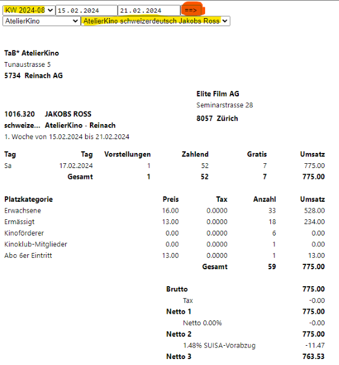
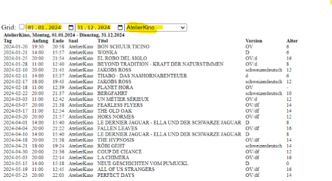
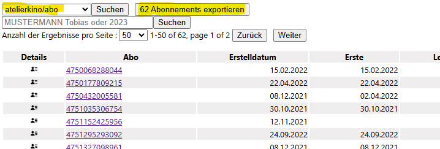
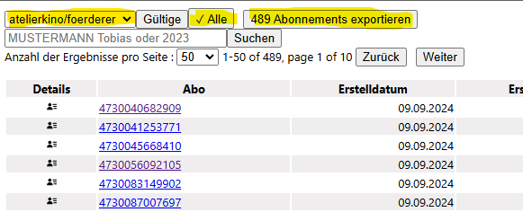
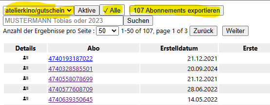

Script Version: 2025 V1.17
 
## Kinoklub 

Script zur Abrechnung für den Kinoklub TaB. Um die Abrechnung für den Kinoklub zu vereinfachen respektive zu automatisieren wurde dieser Script erstellt.\
Dieser Skrip kann mit folgendem Befehl ausgeführt werden:

```         
source("Erstelle Abrechnung.R")
```

\
Bei Fehlern kann ein "Issue" in Github erfasst werden.\
\
Die Datei "README.md" und die Dokumentation wird automatisch erstellt.

```         
source("doc/create Readme and Docu.R")
```

Eine Änderung muss deshalb in der Datei **"doc/README.Rmd"** vorgenommen werden.


## Installation

1.  Download and install R\
    <https://cran.r-project.org/bin/windows/base/>
2.  Download and install Rstudio\
    <https://posit.co/download/rstudio-desktop/>
3.  Download git:\
    <https://git-scm.com/downloads>
4.  Kionklub Scripts download: Navigate to folder you would like to install the Scripts

```         
    git clone https://github.com/slvwagner/Kinoklub
```

6.  Start Rstudio from the Kinoklub folder, or open the project with Rstudio "Kinoklub.Rproj".
7.  Install the needed packages in the R Terminal

```         
# Define libraries to be installed
packages <- c("rmarkdown", "rebus", "openxlsx", "tidyverse", "lubridate", "DT", "shiny", "shinyBS", "magick", "webshot", "xml2")
# Install packages not yet installed
installed_packages <- packages %in% rownames(installed.packages())
if (any(installed_packages == FALSE)) {
  install.packages(packages[!installed_packages])
  invisible(lapply(packages, library, character.only = TRUE))
}
```

7.  Run this command once in R-Terminal, error MSG can be ignored

```         
    webshot::install_phantomjs()
```

### Run the GUI:

```         
    source("GUI.R")
```

## Git Passwort / Personal Access Token (PAT)
Git Passwort gibt es seit 2021 nicht mehr. Um sich bei Git anzumelden, muss man auf der GitHub Webseite unter dem eigenen Profil in den Einstellungen auf **Developer Settings** navigieren. Dann unter **Personal access tokens** **Tokens (classic)** anwählen. Oben rechts auf **Generate new token** klicken und **classic** auswählen. Dem Token einen Namen geben und **Expiration** auf **No Expiration** setzen. Danach alle **repo** anwählen. Nach unten scrollen und Token generieren. Token kopieren und Anleitung unten im Bild folgen. \


## Datensätze

### Advance-Tickets 

Die Datensätze können von <https://www.advance-ticket.ch/admin> heruntergeladen werden und sind unter dem Verzeichnis **.../Kinoklub/input/advance tickets/** abzuspeichern.

#### Eintritte
**Eintritte 02.12.23.txt**  \
Copy paste von html für jede Vorführung und bitte speichern unter "input/advance tickets/Eintritt xx.xx.xx.txt" Es muss die Kalenderwoche sowie der Film ausgewählt werden.\
 \
Alles mit "ctrl a" markieren und kopieren "crtl c" und entsprechend abspeichern("input/advance tickets/Eintritt xx.xx.xx.txt").

#### Kiosk
**Kiosk 02.12.23.txt**  \
Copy paste von html für jede Vorführung und Speichern unter "input/advance tickets/Kiosk xx.xx.xx.txt".\
Im Menu auf "DecompteCaisse" <https://www.advance-ticket.ch/decomptecaisse?lang=de> navigieren.\
Spalte 1 Das Datum muss gewählt werden, Spalte 2 "reinach", Splate 3 "Atelierkino Kasse" und Spalte 4 "..." eingestellt werden.\
 \
Alles mit "ctrl a" markieren und kopieren "crtl c" und entsprechend abspeichern("input/advance tickets/Kiosk xx.xx.xx.txt").

#### Shows
**Shows.txt**  \
Copy paste von html für die gewünschte Abrechnungsperiode. Bitte speichern unter "input/advance tickets/Shows.txt"\
Im Menu auf "Shows" <https://www.advance-ticket.ch/shows?lang=de> navigieren.\
Spalte 1 startdatum wählen 1.1.20xx, Spalte 2 Enddatum wählen 31.12.20xx\


#### Gutscheine und Abos
##### Abos
**"atelierkino_abo.txt"**
Copy paste von html für die gewünschte Abrechnungsperiode. Bitte speichern unter "input/advance tickets/atelierkino_abo.txt"\
Im Menu auf "Abos" <https://www.advance-ticket.ch/abos?lang=de> navigieren.\
Abo typ wählen: **atelierkino/abo** \ und den Button suchen wählen. \
Nun können die Daten exportiert werden. Bitte speichern unter .../Kinoklub/Input/advance tickets \


##### Förderer
**"atelierkino_foerderer.txt"**
Copy paste von html für die gewünschte Abrechnungsperiode. Bitte speichern unter "input/advance tickets/atelierkino_foerderer.txt"\
Im Menu auf "Abos" <https://www.advance-ticket.ch/abos?lang=de> navigieren.\
Abo typ wählen: **atelierkino/abo** \ und den Button suchen wählen. \
Nun können die Daten exportiert werden. Bitte speichern unter .../Kinoklub/Input/advance tickets \


##### Gutschein
**"atelierkino_gutschein.txt"**
Copy paste von html für die gewünschte Abrechnungsperiode. Bitte speichern unter "input/advance tickets/atelierkino_gutschein.txt"\
Im Menu auf "Abos" <https://www.advance-ticket.ch/abos?lang=de> navigieren.\
Abo typ wählen: **atelierkino/abo** \ und den Button suchen wählen. \
Nun können die Daten exportiert werden. Bitte speichern unter .../Kinoklub/Input/advance tickets \



### Excel Dateien

Im Verzeichniss **.../Kinoklub/input/** kann mit Hilfe von Excelfiles folgendes definiert werden:

#### Einkaufspreise

Die Einkaufspreise die ab einem bestimmten Datum gültig sind. "Einkauf Kiosk xx.xx.xx.xlsx"\
Die Einkaufspreise für die Kioskverkäufe müssen gepflegt werden. Ändern sich die Einkaufspreise so muss ein neues File mit neuerem gültigkeis Datum erstellt werden.\

-   Achtung!\
    Die alten Dateien dürfen nicht gelöscht werden.

#### Spezialpreise Kiosk

In der Datei **Spezialpreisekiosk.xlsx** müssen die Sonderangebote (Spez-Verkaufsartikel) definiert werden.\
Diese Datei wird benötigt um die Spezialpreise

-   Spez 1
-   Spez 2
-   Spez 3
-   Spez 4

nach zuschlagen.

#### Verleiherabgaben

Die Verleiherabgaben müssen in der Datei **.../Kinoklub/input/Verleiherabgaben.xlsx** definiert werden.\

-   Für jeden gezeigten Film muss ein Datum definiert sein.
-   Mit dem "Link Datum" ist es möglich Kosten und Einnahme auf die beiden Daten zu verteilen. Es kann also gemeinsam abgerechnet werden. 
-   Im **Tab Verleiherabgaben** muss der **"minimal Abzug"** sowie **"Abzug %"** oder nur der **"Abzug fix [CHF]"** definiert werden. Beide Einträge sind nicht erlaubt.
-   Im **Tab Kinoförderer gratis** muss für jeden Verleiher definiert werden, ob gewisse Platzkategorien (z.B.Kinoförderer Tickets) als gratis abgerechnet werden dürfen.\
    Wenn **nein** gewählt wird, dann wird die Platzkategorie **Kinoförderer** als Platzkategorie "Ermässigt" verrechnet.\
    Der Rechnungsbetrag der Verleiherrechnung an den Kinoklub wird demnach grösser.

#### Einnahmen und Ausgaben

Alle Einnahmen und Ausgaben müssen in der Datei **.../Kinoklub/input/Einnahmen und Ausgaben.xlsx** definiert werden.\
Ja nach **Ausgabentyp** muss eine **Kategorie, (Buchhaltungskonto)** verwendet werden. Das ist nötig um die Einnahmen und Ausgaben korrekt in den  **Berichten** auszuwerten. 

-   Im Excel-Arbeitsblatt **Einnahmen** werden alle Einnahmen die nicht automatisch aus den Advaced Tickets Daten extrahiert werden können.
    Für jede Buchung muss einen Kategorie (Buchhaltungskonto) ausgewählt werden. 
-   Im Excel-Arbeitsblatt **Ausgaben** werden die Ausgaben verbucht die nicht aus den Advanced Tickets Daten extrahiert werden können.  \
    Für jede Buchung muss einen Kategorie (Buchhaltungskonto) ausgewählt werden. 
-   Kurze Erklärung der **Spaltennamen**
    -   **Kategorie** \
        Die Kategorie muss korrekt ausgewählt werden. Hier eine kurze Erklärung aller Optionen:
        -   Event \
            Die Kategorie Event wird in der Abrechnung (Abrechnung pro Film) aufgeführt. Als **Ausgaben** können dies Spezielle Verkaufsartikel (Gipfeli), Materialmiete für diesen Anlass, Event-Deko oder andere Ausgaben sein. Als **Einnahmen** Kollekten, Beiträge von Veranstallter oder sonstige Einnahmen sein. Diese Einnahmen oder Ausgaben müssen sich auf eine spezifische Filmvorführung beziehen. WICHTIG: Die Einnahmen dürfen nicht gleichzeitg auch mit dem Advace Tichekt System verbucht werden.
        -   Kiosk \
            Ausgaben für den Einkauf des Kino-Kiosks
        -   Personalaufwand \
            Ausgaben für Gehaltszahlung and Mitarbeiter
        -   Sonstiges \
            Alle Kosten die nicht auf eine spezifische Kategorie zugewiesen werden können. 
        -   Verleiher \
            Ausgaben: Rechnungen vom Filmverleiher WICHTIG: hier muss das Spieldatum des Filmes eingetragen werden, damit die Abrechnung korrekt abläuft
        -   Vermietung \
            Ausgaben oder Einnahhmen die für einen Vermietung getätigt werden.
        -   Werbung \
            Allgemeine Werbekosten oder Einnahmen die nicht auf eine Filmvorführung abgewälzt werden können 
    -   **Spieldatum** \
        Wird die Kategorie Event oder Verleiher ausgewählt muss hier das Spieldatum des Films eingetragen werden, damit die Ausgaben/Einnahmen für dieses Datum auf der Abrechnung pro Film ausgewiesen werden kann. Bei Ausgaben/Einnahmen die sich nicht auf ein spezifisches Datum beziehen, kann dieses Feld leer gelassen werden. WICHTIG: Das Datumsformat DD.MM.YYYY muss beibehalten werden.
    -   **Bezeichnung** \
        Umschreibung der Buchung
    -   **Datum** \
        Datum der Rechnung/Buchung. WICHTIG: Das Datumsformat DD.MM.YYYY muss beibehalten werden.
    -   **Betrag** \
        Betrag der Buchung WICHTIG: Das Format der Zelle muss beibehalten werden.
    -  **Firmenname** \
        Name der rechnugsstellenden Firma oder jene deren ein Betrag ausbezahlt werden muss. 
    -   **Adresse** Rechnungsteller
    -   **Referenz** Referenznummer der Rechnung
    -   **Rechnungsnummer** Rechnungsnummer des Rechnungsstellers
    -   **Buchungskonto** Buchungskonto in Bexio (Buchhaltungstool TaB), muss Geschäftsleitung weitergegeben werden um Buchung korrekt durchzuführen
    -   **Buchungskonto Name** Buchungskonto Name in Bexio (Buchhaltungstool TaB), muss Geschäftsleitung weitergegeben werden um Buchung korrekt durchzuführen
-   Im Excel-Arbeitsblatt **dropdown** sind die möglichen Kategorien (Buchhaltungskonten) definiert. Notwendige Änderungen müssen zuerst besprochen werden, ansonsten kann es sein, dass das R-Tool nicht mehr funktioniert. 

#### WordPress Filmvorschläge auswerten
Auf der Kinoklub.ch Hompage können alle erfassten Filmvorschläge exportiert werden und als .csv Datei im Ordner **.../input/WordPress/** abgespeichert werden. Die Daten wird bereinigt und als Excel ausgegeben.
```
.../Kinoklub/output/data/Filmvorschläge.xlsx
```

## Benutzereinstellungen

Die Datei **"user_settings.R"** enthält am Anfang die folgenden Definition die abgeändert werden können um das Verhalten des Scripts zu beeinflussen.

### Sommerpause
Wiel lange dauer die Sommerpause? \

sommerpause \<- 65 # Tage


### Inhaltsverzeichnisse

Sollen die erstellten Berichte mit Inhaltsverzeichniss erstellt werden?

-   Ja\
    `toc` \<- TRUE
-   Nein\
    `toc` \<- FALSE

### Mehrwertsteuersatz

c_MWST \<- 8.1 #%

### Platzkategorien ohne Umsatz die dennoch abgerechnet werden müssen.

Für gewisse Verleiher müssen zusätzliche Platzkategorieen abgerechnet werden. Die Defintion findet sich in der Datei "Verleiherabgaben.xlsx" TAB "Kinoförderer gratis".\
Die Variable `df_P_kat_verechnen` definiert welche Platzkategorien ohne Umsatz zusätzlich verrechnet werden und zu welchem Preis.\
`df_P_kat_verechnen` \<- tibble(Kinoförderer = c("Kinoförderer","Kinofördererkarte"), 
                             Verkaufspreis =  c(13,13)).

### Ausgabeformate

-   `c_render_option` \<- "1" only html
-   `c_render_option` \<- "2" only docx
-   `c_render_option` \<- "3" only pdf (Achtung für pdf install Latex for Windows (Miktex) for Mac (MacTex))
-   `c_render_option` \<- "4" html and docx
-   `c_render_option` \<- "5" html and pdf (Achtung für pdf install Latex for Windows (Miktex) for Mac (MacTex))
-   `c_render_option` \<- "6" docx and pdf (Achtung für pdf install Latex for Windows (Miktex) for Mac (MacTex))
-   `c_render_option` \<- "7" html, docx and pdf (Achtung für pdf install Latex for Windows (Miktex) for Mac (MacTex))


## Berichte

Alle Dateien die erzeugt wurden finden sich im **.../Kinoklub/output/** Verzeichniss.

-   Für jede Filmvorführung respektive Datum wird ein Abrechnung erstellt.
-   Es wird eine Jahresbarechnung und eine detalierte Jahresabrechnung erstellt.
-   Es wird eine Statistik mit Porgnosen erstellt.
-   Alle verwendeten Datensätze werden in ein Excelfile abgespeichert.

### Abrechnung Filmvorführung

Es wird eine Filmabrechnung pro Event (Datum) erstellt.

-   Übericht
-   Filmvorführung
    -   Kino Besucherzahlen und Umsatz
        -   Filmabgaben
        -   Verleiherrechnung\
            In der Datei **".../Kinoklub/input/Einnahmen und Ausgaben.xlsx"** in den **Ausgaben**\
            wird die Kategorie **Verleiher** berücksichtigt.
        -   Prozentualle Abgaben\
            Der Suisaabzug wird vom Umsatz berechnet. \
            In der Datei **".../Kinoklub/input/Verleiherabgaben.xlsx"** sind **Abzug %**, **Minimal Abzug** oder **Abzug fix [CHF]** definiert. \
            
                1.    Fall: \
                      ("Netto3" x "Abzug") > "Minimal Abzug" \
                      Verleiherabzug: "Netto3" x "Abzug %"
                2.    Fall: \
                      ("Netto3" x "Abzug %") < "Minimal Abzug" \
                      Verleiherabzug: Minimal Abzug
                3.    Fall: \
                      "Abzug fix [CHF]" \
                      Verleiherabzug: "Abzug fix [CHF]"
                      
        -   Reklamematerial und Porto \
            Das **Reklamematerial und Porto** werden aus der Differenz der **Verleiherrechnung** und den **Prozentualle Abgaben** berechnet.
        -   MWST auf Verleiherrechnung \
            1.  Fall: Vereiherrechnung vorhanden \
                MWST wird mit der Verleiherrechnung berechnet.
            2.  Fall: Vereiherrechnung nicht vorhanden \
                MWST wird aus dem Umsatz berechnet.
    -   Gewinn / Verlust aus Tickerverkauf\
        Der Gewinn/Verlust wird aus **Umsatz** - (**Suisa-Abzug**+**Verleiherabzug**+**MWST**+**Reklamematerial und Porto**)
-   Event
    -   Einnahmen
        -   In der Datei **".../Kinoklub/input/Einnahmen und Ausgaben.xlsx"** in den **Ausgaben**\
            wird die Kategorie **Vermietung** wird pro Filmabrechnung (Datum) berücksichtigt.
    -   Ausgaben
        -   In der Datei **".../Kinoklub/input/Einnahmen und Ausgaben.xlsx"** in den **Ausgaben**\
            wird die **Eventausgaben** wird pro Filmabrechnung (Spieldatum) berücksichtigt.
-   Kiosk
    -   Gewinn pro Artikel\
        In der Datei **".../Kinoklub/input/Einkauf Kiosk xx.xxx.xx.xlsx"** ist der Gewinn pro Artikel definiert.
    -   Umsatz Für den Verkaufsartikel gibte es keine Definition in der Datei **".../Kinoklub/input/Einkauf Kiosk xx.xxx.xx.xlsx"**\
    -   Einnahmen\
        Die Einnahmen werden aus Gewinn pro Artikel und dem Umsatz für Spezialpreise berechnet.
    -   Ausgaben\
        Achtung!\
        Für Verkaufsartikel ohne Lieferant müssen Eventausgaben definiert werden.
-   Kioskumsatz pro Gast
    -   Kioskumsatz aller Gäste
    -   Kioskumsatz pro zahlender Gast
-   Kasse\
    Die Kioskkasse wird auch für Barauszahlung von stornierten Tickets genutzt.
-   Gewinn / Verlust\
    Summe aus Einnahmen und Ausgaben

#### Berechnung der prozentuallen Abgaben 

- Verleiherrechnung noch nicht vorhanden
    -   Umsatz: \
    Der Umsatz muss je nach Verleiher anders berechnet werden. Bei gewissen Verleihern müssen die Kinoförderer als Umsatz ausgewiesen werden obwohl kein Umsatz an der Kinokasse gemacht wurde.(Die Kinoförderer Tickets werden gegen einen Mitgliederbeitrag abgegeben und wurden demnach Verkauft.)
    -   Suisa-Vorabzug: \
    $U_{msatz}\cdot  \frac {s_{uisaVorabzugProzent}}{100}$
    -   Netto3: \
    $U_{msatz}-S_{uisa-Vorabzug}$
    -   Verleiherabgaben: \
    $N_{etto3} \cdot V_{erleiherabgabenProzent} > M_{indestGarantie} => N_{etto3} \cdot V_{erleiherabgabenProzent}$ \
    $N_{etto3} \cdot V_{erleiherabgabenProzent} < M_{indestGarantie} => M_{indestGarantie}$
    -   Mehrwertsteuer: \
    $V_{erleiherabgaben}\cdot \frac{M_{WST}}{100}$
    -   Gewinn / Verlust: \
    $U_{msatzKinokasse} - (S_{uisa-Vorabzug} + V_{erleiherabgaben} + M_{WST})$ 
    
- Verleiherrechnung vorhanden
    -   Umsatz: \
    Der Umsatz muss je nach Verleiher anders berechnet werden. Bei gewissen Verleihern müssen die Kinoförderer als Umsatz ausgewiesen werden obwohl kein Umsatz an der Kinokasse gemacht wurde.(Die Kinoförderer Tickets werden gegen einen Mitgliederbeitrag abgegeben und wurden demnach Verkauft.)
    -   Suisa-Vorabzug: \
    $U_{msatz}\cdot  \frac {s_{uisaVorabzugProzent}}{100}$
    -   Verleiherrechnung: \
    Verleiherrechnungsbetrag inklusive Mehrwertsteuer \
    $\frac {V_{erleiherrechnung}}{1+\frac{M_{WST}}{100}}\cdot\frac{M_{WST}}{100}$
    -   Gewinn / Verlust: \
    $U_{msatzKinokasse} - (S_{uisa-Vorabzug} + V_{erleiherrechnung})$ 

#### Berechnung der Fixen Abgaben

- Verleiherrechnung noch nicht vorhanden
    -   Umsatz: \
    Der Umsatz muss je nach Verleiher anders berechnet werden. Bei gewissen Verleihern müssen die Kinoförderer als Umsatz ausgewiesen werden obwohl kein Umsatz an der Kinokasse gemacht wurde.(Die Kinoförderer Tickets werden gegen einen Mitgliederbeitrag abgegeben und wurden demnach Verkauft.)
    -   Suisa-Vorabzug: \
    $U_{msatz}\cdot  \frac {s_{uisaVorabzugProzent}}{100}$
    -   Verleiherabgaben \
    -   Mehrwertsteuer: \
    $V_{erleiherabgaben}\cdot \frac{M_{WST}}{100}$
    -   Gewinn / Verlust: \
    $U_{msatzKinokasse} - (S_{uisa-Vorabzug} + V_{erleiherabgaben} + M_{WST})$ 
    
- Verleiherrechnung vorhanden
    -   Umsatz: \
    Der Umsatz muss je nach Verleiher anders berechnet werden. Bei gewissen Verleihern müssen die Kinoförderer als Umsatz ausgewiesen werden obwohl kein Umsatz an der Kinokasse gemacht wurde.(Die Kinoförderer Tickets werden gegen einen Mitgliederbeitrag abgegeben und wurden demnach Verkauft.)
    -   Suisa-Vorabzug: \
    $U_{msatz}\cdot  \frac {s_{uisaVorabzugProzent}}{100}$
    -   Verleiherrechnung: \
    Verleiherrechnungsbetrag inklusive Mehrwertsteuer \
    $\frac {V_{erleiherrechnung}}{1+\frac{M_{WST}}{100}}\cdot\frac{M_{WST}}{100}$
    -   Gewinn / Verlust: \
    $U_{msatzKinokasse} - (S_{uisa-Vorabzug} + V_{erleiherrechnung})$ 

### Jahresabrechnungen

Die Einnahmen und Ausgaben werden für die Jahresabrechnung verwendet und je nach Kategorie der Rechnung zugewiesen. Die folgenden Kategorien werden in den Jahresrechnungen separat behandelt.

-   Filmvorführungen
    -   Eintritt
        -   Einnahmen Ticketverkauf
        -   Abgaben Ticketverkauf
            -   Suisaabgaben
            -   Verleiherabgaben
            -   Nebenkosten
            -   MWST auf Verleiherleistungen
-   Event
    -   Eventeinnahmen \
        Einnahmen für den Event, z.B. Beiträgemitveranstalter, Eventsponsoring, ...
    -   Eventausgaben\
        Alle Ausgaben die für den Event, z.B. Werbung, Esswaren, Spesen, …
-   Kiosk
    -   Einnahmen \
        Die Einnahmen werden mit **"Anzahl x Verkaufspeis für Verkaufsartikel"** berechnet.
    -   Ausgaben
        -   Einkauf Getränke\
            Die Getränke werden von Theater am Bahnhof eingekauft.\
            Falls in der Datei **.../Kinoklub/input/Einkauf Kiosk xx.xx.xx.xlsx** der Lieferant **"Schüwo"** definiert wurde wird der Verkaufsartikel als Getränk ausgegeben.\
            Der Getränkeeinkauf wird mit **"Anzahl x Einkaufspreis"** berechnet.
        -   Einkauf Kino\
            Für alle Verkaufsartikel mit Ausnahme der Getränke wird in der Datei **".../Kinoklub/input/Einnahmen und Ausgaben.xlsx"**   mit Kategorie **Kiosk** definiert.
-   Abos / Kinogutscheine
    - Einnahmen
        - Abos
        - Kinogutscheine
        - Summe
    - Eingelöst
        - Abos
        - Kinogutscheine
    - Kurzfristiges zinsloses Fremd-Kapital
-   Vermietung
    -   Einnahmen \
        Vermietung Kinosaal, Beiträge von mit Veranstallter, ...
    -   Ausgaben \
        Mietkosten für Filme und Material, ...
-   Werbung
    -   Einnahmen \
        Die Werbeeinnahme aus Kinowerbung druch Trailers, Dias für Sponsoren, ...
    -   Ausgaben \
        Inserate, Drucksachen, Homepage, ...
-   Personalaufwand \
    Löhne
-   Sonstiges
    -   Einnahmen \
        Sponsoen, Gönner, Kulturbeiträge, ...
    -   Ausgaben \
        Kinomiete an Theater am Bahnhof AG, Mitgliederbeiträge, Ciné Bulletin, ...


### Statistik

-   Gewinn/Verlust
    -   Prognose \
        Die Prognose wird mit der Kumuliertensumme pro Datum als lineares Model erstellt.
-   Ticketverkauf
    -   Prognose \
        Die Prognose wird mit der Kumuliertensumme pro Datum als lineares Model erstellt.
    -   Eintritte
        -   Anzahl \
            Diagramm
        -   Umsatz
            -   Prognose \
                Die Prognose wird mit der Kumuliertensumme pro Datum als lineares Model erstellt.
    -   Filmabgaben
        -   Prognose \
            Die Prognose wird mit der Kumuliertensumme pro Datum als lineares Model erstellt.
-   Abos
    -   Einnahmen
    -   Eingelöst
    -   Kredit
-   Kiosk-Gewinn pro Vorführung
    -   Prognose \
        Die Prognose wird mit der Kumuliertensumme pro Datum als lineares Model erstellt.
-   Kiosk
    -   Verkaufsartikel
    -   Ladenhüter (keine Verkäufe)
    -   Kiosk Umsatz pro Gast
        -   Prognose \
            Die Prognose wird mit der Kumuliertensumme pro Datum als lineares Model erstellt.
    -   Umsatz pro zahlender Gast
        -   Prognose \
            Die Prognose wird mit der Kumuliertensumme pro Datum als lineares Model erstellt.

### Daten als Excel-Datei
Die Eingelesenen und verarbeiteten Datensätze werden in eine Excel-Datei gespeichert. \
```
.../Kinoklub/output/data/Auswertung.xlsx
```
zusätzlich werden alle Fimvorschläge als Excel ausgegeben
```
.../Kinoklub/output/data/Filmvorschläge.xlsx
```

## Versionshistorie

2024 V1.0 Go Live mit Stefan Jablonski, Nadia und Florian Wagner  \
2024 V1.1 Verkauf von Abos und Gutscheinen wird in der Jahresabarechnung berücksichtigt    \
2024 V1.2 Abrechnung für Kinowerbung hinzugefügt:..../output/Auswertung.xlsx und Prognosen in der Statistik überarbeitet  \
2024 V1.3 Neuer Bericht Statistik_DT hinzugefügt. Interaktives durchsuchen aller Tabellen   \
2024 V1.4 Jahresbarechnung detailed entfernt  \
2024 V1.5 Merge Verkaufsartikel "Popcorn frisch", "Popcorn Salz" zu "Popcorn frisch"  \
2024 V1.6 Statistik: Wochentaganalyse  \
2024 V1.7 Statistik ohne Datatable gelöscht  \
2024 V1.8 Dokumentations update   \
2024 V1.9 Filmvorschläge from Wordpress   \
2024 V1.10 PowerBi script  \
2024 V1.11 WordPress Filmvorschläge auswerten  \
2024 V1.12 Verleiherrechnung nur erstellen falls nötig (Kinoförder Gratis => nein, in Verleiherabgaben.xlsx)  \
2024 V1.13 Gemeinsame Abrechnung über Link Datum in Excel file "Verleiherabgaben.xlsx"  \
2024 V1.14 GUI Graphical user interface   \
2024 V1.15 Fake Suisa Nummer von Advanced Tickets kann nun auch verarbeitet werden   \
2024 V1.16 Introduction of envirnonments to run GUI  \
2025 V1.17 Data typ for excel files are definded by column type database   \


